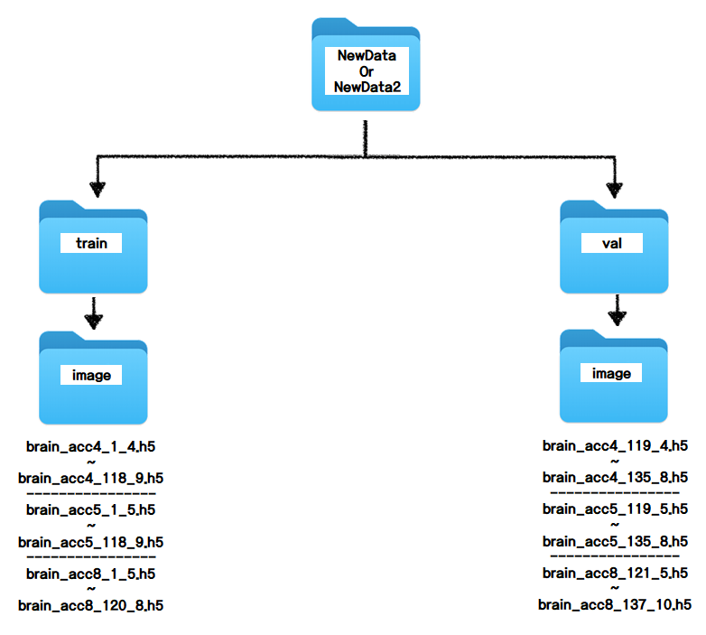
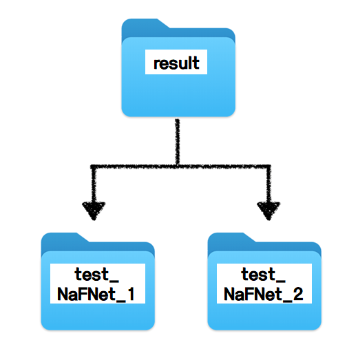

# 팀 고민보다 고능 README

본 저장소에는 2024 SNU FastMRI Challenge에 제출한 코드 중 FastMRI_challenge 디렉토리 이하의 파일들만 포함되어 있습니다.
대회 종료 이후 정리 목적으로 최종 제출에 사용된 코드만 업로드한 저장소입니다. 데이터 파일과 결과는 포함되어 있지 않습니다.

모델 구조, 학습 전략 및 접근 방법에 대한 자세한 설명은 2024 FastMRI challenge.pptx 자료를 참고하시기 바랍니다.

본 팀은 해당 대회에서 총 160개 팀 중 6위를 기록하였으며, leaderboard 점수는 0.9800, private 점수는 0.9845입니다.

## 1. 폴더 계층

### 폴더의 전체 구조

* FastMRI_challenge, Data, NewData, NewData2, result 폴더가 위의 구조대로 설정되어 있습니다.
* Data 폴더는 제공받은 MRI data 파일을, NewData와 NewData2 폴더는 제공받은 MRI data를 이용하여 생성해낸 data를 담고 있으며 아래에 상세 구조를 첨부하였습니다.
* result 폴더는 학습한 모델의 weights을 기록하고 validation, leaderboard dataset의 reconstruction image를 저장하는 데 활용되며 아래에 상세 구조를 첨부하였습니다.

### Data 폴더의 구조

* train, val:
    * train, val 폴더는 각각 모델을 학습(train), 검증(validation)하는 데 사용되며 image, kspace 폴더로 나뉩니다.
    * image와 kspace 폴더에 들어있는 파일의 형식은 다음과 같습니다: brain_{mask 형식}_{순번}.h5
    * ex) brain_acc8_3.h5  
    * {mask 형식}은 "acc4", "acc5", "acc8" 중 하나입니다.
    * "acc4"와 "acc5"의 경우 {순번}은 1 ~ 118, "acc8"의 경우 {순번}은 1 ~ 120 사이의 숫자입니다. 
* leaderboard:
   * leaderboard 폴더는 mask 형식에 따라서 acc5과 acc9 폴더로 나뉩니다.
   * acc5과 acc9 폴더는 각각 image, kspace 폴더로 나뉩니다.
   * image와 kspace 폴더에 들어있는 파일의 형식은 다음과 같습니다: brain_test_{순번}.h5
   * {순번}은 1 ~ 58 사이의 숫자입니다.
  
### NewData, NewData2 폴더의 구조

* train, val:
    * train, val 폴더는 각각 모델을 학습(train), 검증(validation)하는 데 사용되며 내부에 image 폴더가 존재합니다.
    * 해당 폴더는 Data 폴더에 존재하는 데이터에서 변경된 mask로 생성한 image data를 저장한 것으로, 기존 image 파일과 달리 mask도 함께 저장되어 있습니다.
    * NewData에는 기존 train data, val data의 각각 2배가 되는 양의 데이터, NewData2에는 기존 train data의 3배, val data의 2배가 되는 양의 데이터가 들어있습니다.
    * image 폴더에 들어있는 파일의 형식은 다음과 같습니다: brain_{기존 mask 형식}\_{기존 순번}_{새로운 mask 형식}.h5
    * ex) brain_acc8_3_7.h5  (Data 폴더에 있는 brain_acc8_3.h5를 acc값이 7이 되도록 재구성한 것)
    * ```sh recreate_data.sh```를 통해 NewData를, ```sh recreate_data_2.sh```를 통해 NewData2를 생성할 수 있습니다. 또한,  ```load_data.py```를 수정하여 kspace는 Data 폴더에서 image와 mask는 NewData, NewData2 폴더에서 불러오게 하였습니다.


### result 폴더의 구조

* result 폴더는 모델에 따라 'test_NaFNet_1', 'test_NaFNet_2'로 나뉘어져 있습니다. 'test_NaFNet_2'가 최종 모델 폴더이며, 'test_NaFNet_1'은 'test_NaFNet_2'를 생성하는 과정에 필요한 폴더입니다.
* 각 폴더는 아래 3개의 폴더로 구성되어 있습니다.
  * checkpoints - `model.pt`, `best_model.pt`의 정보가 있습니다. 모델의 weights 정보를 담고 있습니다.
  * reconstructions_val - validation dataset의 reconstruction을 저장합니다. brain_{mask 형식}_{순번}.h5 형식입니다.
  * reconstructions_leaderboard - leaderboard dataset의 reconstruction을 저장합니다. brain_test_{순번}.h5 형식입니다.
  * val_loss_log.npy - epoch별로 validation loss를 기록합니다.

## 2. 폴더 정보

```bash
├── recreate_data.py
├── reconstruct.py
├── leaderboard_eval.py
├── README.md
├── train.py
├── train_wandb.py
└── utils
│   ├── common
│   │   ├── loss_function.py
│   │   └── utils.py
│   ├── data
│   │   ├── load_data.py
│   │   ├── transforms.py
│   │   ├── grappa.py
│   │   ├── transforms_simple.py
│   │   └── sobel.py
│   ├── learning
│   │   ├── test_part.py
│   │   ├── train_part.py
│   │   └── train_part_wandb.py
│   ├── model
│   │   ├── varnet.py
│   │   ├── unet.py
│   │   ├── sensitivity.py
│   │   ├── nafnet.py
│   │   ├── stack_model.py
│   │   ├── eamri.py
│   │   ├── eastack_model.py
│   │   ├── eanaf_model.py
│   │   └── networkUtil.py
│   └── mraugment
│       ├── data_augment.py
│       └── helpers.py
└── result
    ├── test_NaFNet_1
    └── test_NaFNet_2
```

## 3. How to set?
```bash
pip3 install numpy
pip3 install h5py
pip3 install scikit-image
pip3 install fastmri
pip3 install einops
pip3 install opencv-python-headless
```

## 4. How to create data?
```bash
sh recreate_data.sh
sh recreate_data2.sh
```
- 차례대로 실행하면 됩니다.

## 5. How to train?
```bash
sh train.sh
sh train2.sh
```
- 차례대로 실행하면 됩니다.
- validation 시 train.sh는 reconstruction data를 ```result/test_NaFNet_1/reconstructions_val/```에, train2.sh는 ```result/test_NaFNet_2/reconstructions_val/```에 저장합니다.
- epoch 별로 validation dataset에 대한 loss를 기록합니다.

## 6. How to reconstruct?
```bash
sh reconstruct.sh
```
- leaderboard 평가를 위한 reconstruction data를 ```result/test_NaFNet_2/reconstructions_leaderboard```에 저장합니다.

## 7. How to evaluate LeaderBoard Dataset?
```bash
sh leaderboard_eval.sh
```
- leaderboard 순위 경쟁을 위한 SSIM 값을 한번에 구합니다.
